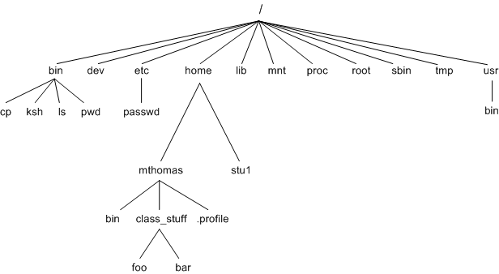

## Learning Objectives

By the end of this lecture students will:

* Understand what bash is and what role your `.bash_profile` plays
* Understand how to navigate through their file system using `mv`, `cp`, `rm`, `cd`, `ls`, `mkdir` 
* Understand what the `$PATH` variable is

## What is Bash

MacOS comes with a piece of software called Terminal. Terminal is a graphical interface that allows us to interact with our **shell**. A shell is a program that takes keyboard commands and passes them to our operating system. The particular implementation of a shell most of us will be using is called bash which is an acronym for *Bourne Again Shell*. It was created by Steve Bourne. On UNIX-based operating systems like Ubuntu and MacOS the entire file system is represented as single file tree.



What is UNIX you ask?

> Unix is a family of multitasking, multiuser computer operating systems that derive from the original AT&T Unix, developed starting in the 1970s at the Bell Labs research center by Ken Thompson, Dennis Ritchie, and others.

To determine which shell you are using use this command:

```sh
echo $SHELL
```

Or, this command:

```sh
echo $0
```

The code above is a part of the bash scripting language. `echo` prints out a value and `$SHELL` and `$0` are variables.

The way we typically use bash is to give it commands that it then executes. All bash commands have a similiar structure: 

```sh
$ <command> <-option(s)> <argument(s)>
```

### Editing Your .bash_profile

There is a hidden file in your Mac’s user directory named `.bash_profile`. This file is loaded before Terminal loads your shell environment and contains all the startup configuration and preferences for your command line interface. Within it you can change your terminal prompt, change the colors of text, add aliases to functions you use all the time, and so much more.

This file is often called a "dot file" because the `.` at the beginning of it’s name makes it invisible in the Mac Finder. You can view all invisible files in the Terminal by typing `ls -la` in any directory.

Let's create an **alias** (shortcut) command that will navigate to your copy of the class repository whenever you type `repo` in the shell. We will do this by editing the hidden `.bash_profile` file. Let's open up your `bash_profile` in VS Code.

```sh
$ code ~/.bash_profile
```
Now add this line (preferably near other aliases) to your `bash_profile`:

```sh
alias c='cd ~/code/<path to repo folder>'
```

Pressing `<Command+S>` will save the file. Close Terminal then re-open it and type `repo` to test it out. It should have taken you to your copy of the class repo.

## Navigating the File System

Now that we know what bash is and how our files and directories are organized on our computer let's learn how to explore our file system. Bash provides us with a number of commands to navigate the filesytem. We will be using the following commands:

* `mkdir` - Create directories
* `mv` - Move/rename files and directories
* `cp` - Copy files and directories
* `rm` - Remove files and directories
* `cd` - Change directories
* `ls` - List current directory contents
* `pwd` - Print name of current working directories

We use the `cd` command to change directories. Let's change to the `home` directory of the logged in user:

```sh
$ cd ~
```

Here are a few common shortcut commands you can use to navigate the file system.

* `cd ~`: Navgiates to the user's home directory.
* `cd /`: Navigates to the user's root directory.
* ` cd .`: Navigates to the current directory
* `cd ..`: Navigates to the parent directory of the current directory

The `ls` command provides us with a list of the files and sub-directories in a given directory. `ls` does not display hidden files by default, adding the `-a` option will show them. A hidden file is one prefixed with a dot(`.`) for example `.gitignore` is a hidden file and will not appear when using `ls` normally.

`tree` is a nice utility for displaying a graphical representation of a directory and its nested directories.

Install it by typing `brew install tree`.

Use the `mkdir` command to create directories. Let's create a `dir1` directory inside of the `home` directory:

```sh
$ mkdir ~/dir1
```

By default bash does tab completion for us. Navigate to the home directory:

```sh
$ cd ~
```

Then, type `cd d + <TAB>`, which auto-complete the directory name.

We use the `touch` command to create empty files. Let's move into the `dir1` directory and create a sub-directory named `subdir1`. Here is how we can create the directory **and** change to it using a single command:
	
```sh
$ mkdir socks && cd socks
```

The `&&` command allows us to chain commands together.

Now let's create a `text.txt` file inside `subdir1`. Let's add the text 'This is some text' into our `text.txt` file.

```sh
$ cd subdir1 && touch text.txt
$ echo 'This is some text' > text.txt
```

`mv` allows us to move files and rename files.

This is how we rename files:

```sh
$ mv ~/drawers/pjs/warm.pjs ~/drawers/pjs/summer.pjs
```

This is how we move files:

```sh
$ mv ~/drawers/pjs/favorite.socks ~/drawers/socks/
```

The structure of the command above is:

```sh
$ mv <file-to-be-moved> <target-location>
```

Using the `*` wildcard character, it's possible to delete and move multiple files. For example, typing `*.txt` would match all files with an extension of `.txt`.

Deleting directories is almost the same as deleting files except you must use the `-rf` option, which runs the `rm` command "recursively" and "forces" the deletion of directories.

To delete the `fun` folder we could use this command:

```sh
? rm -rf ~/fun
```

Unix-like operating systems do not have an "undelete" command. Once you delete something using `rm` its gone forever.

The `$PATH` variable is a environment variable that tells your computer which directories your executable files are located. Whenever you type a command into bash, bash looks for that command in the directories listed in your `$PATH` variable.