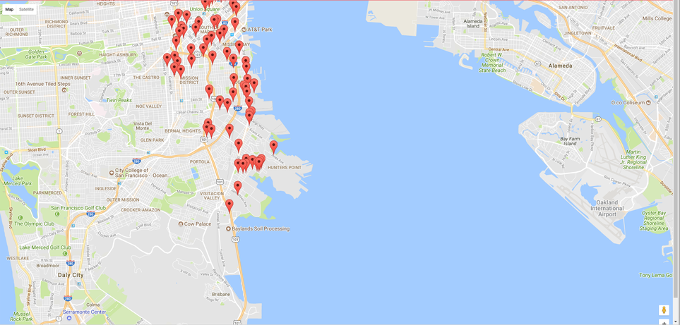

# Hackathon: Choose Your Own Express Application

The goal of this exercise is to give you a small and relatively simple Express application to build on your own. It's my hope that building this will force you to review concepts and technologies that you don't yet feel comfortable with. This exercise will require you to engage with the material that you've learned in the last two weeks and will ask questions of your understanding.

**GOAL**: I have provided you with *two* application ideas. Pick one of these ideas and build it out according to specification.

## Choices

### Choice 1: Google Maps API + Data SF API

Use the Google Maps API and the [City of San Francisco API](https://datasf.org/opendata/) to create a map with markers for each food truck in San Francisco. This will involve minimal server-side code and will all be coded inside of an `*.ejs` file.

#### SF Data API 

This application uses the [DataSF Food Truck API](https://data.sfgov.org/Economy-and-Community/Mobile-Food-Facility-Permit/rqzj-sfat). The API endpoint we are hitting is:

```
https://data.sfgov.org/resource/6a9r-agq8.json
```

Documentation for this API can be found [here](https://dev.socrata.com/foundry/data.sfgov.org/6a9r-agq8).

**Use Postman to make a GET request to this API to better understand what data it returns.**

The array that is returned as a result of this API call consists of objects. Each object contains data about a food truck in SF. There is one property we care about for each food truck object: 

* `location` - Food trucks location (lat/long coordinates)

Use the `fetch` API to grab food truck data and pass it along the the Google Maps API to add markers.

#### Google Maps API

To use the Google Maps API you must first create an application key. You can do this [here](https://developers.google.com/maps/documentation/javascript/get-api-key). Your key is then put in the `<script>` tag that links to the Google Maps API:

```js
<script src="https://maps.googleapis.com/maps/api/js?key=<your-key>&callback=initMap" async defer></script>
```

Using  Google Maps requires an `initMap` function that is called by the `<script>` above. You can adjust where the map centers and its initial zoom level:

```js
function initMap() {
        map = new google.maps.Map(document.getElementById('map'), {
          center: {lat: 37.753717, lng: -122.388359},
          zoom: 14
        });
      };
```

You then want to fetch the data from the API. For each data point you want to add a marker on the map and pass in the latitude and longitude of the marker:


```js
marker = new google.maps.Marker({
    position: new google.maps.LatLng(latitude, longitude),
    map: map
});
```

Please consult the Google Maps documentation [here](https://developers.google.com/maps/documentation/javascript/adding-a-google-map).

The finished application should look something like this: 



---

### Choice 2: Web Scraper + Expose API 

>Web Scraping is a technique employed to extract large amounts of data from websites whereby the data is extracted and saved to a local file in your computer 

Build a web scrapper to grab the data from [this](http://www.jtamsut.com/dummy-text/) table and expose an API that returns the data from the table in JSON form.

You should expose 2 API endpoints: 

```
api/employees // GET all employees
api/employees/:id // GET a single employee by id
```

The JSON that is returned by your API should have the following properties: 

* id
* name
* position
* office
* age
* start_date
* salary 

**Note: You will have to generate the `id` property. `id`'s should start at 0 and increment by one as you move down the table.

**You do not need to persist the data you scrape in a MongoDB database. It can be stored in memory.**

Using the request module make a `GET` request to the following URL: http://www.jtamsut.com/dummy-text/. 

```js
request('http://www.jtamsut.com/dummy-text/', function (error, response, html) {
  if (!error && response.statusCode == 200) {
    console.log(html);
  }
});
```

Parse the resulting HTML and grab data from HTML table. Put this data inside of an object that looks something like this: 

```js
{
    id: 0,
    name: "Tiger Nixon",
    position: "System Architect",
    office: "Edinburgh",
    age: 61,
    start_date: "2011/04/25",
    salary: "$320,800"
}
```

Use jQuery to parse the HTML. The `:first-child` psuedoclass and its derivatives will be helpful for this task. [Here](https://developer.mozilla.org/en-US/docs/Web/CSS/:first-child) is some documentation for `:first-child`.


